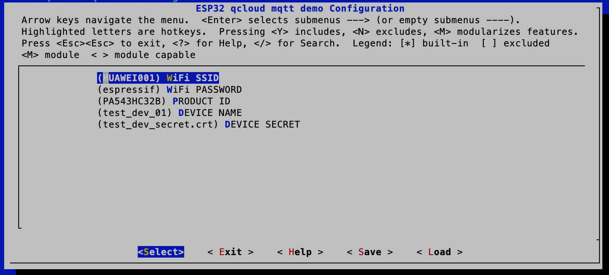

## 0. 章节介绍：

* **1. 概述：** 介绍背景。
* **2. Demo 使用：** 介绍如何连接腾讯云，包括环境搭建、编译下载、执行等。
* **3. 相关链接：** 给出与腾讯云相关的链接。包括 SDK 下载，腾讯云文档。

## 1. 概述

ESP32 & ESP8266 适配了[腾讯云](https://cloud.tencent.com) 设备端 C-SDK v2.2.0 版本, 用户可以参考 Espressif 提供的设备端 MQTT Demo 进行二次开发，快速接入腾讯云平台。

MQTT Demo 参考腾讯官方 [qcloud-iot-sdk-embedded-c v2.2.0](https://github.com/tencentyun/qcloud-iot-sdk-embedded-c) 里的 demo，添加了基于 esp32 & esp8266 的 WiFi 连接、cert 存储等相关功能，用户可根据产品需求自行添加或删减相关功能

## 2. Demo 使用

用户拿到乐鑫的 esp-qcloud 后，编译下载固件到乐鑫 ESP32 & ESP8266 开发板。设备侧首先连接路由器, 然后连上腾讯云, 在设备侧以及腾讯云端可以看到相应的调试 log。

### 2.1. 环境搭建

* 硬件准备

*  **开发板**：
    * ESP32 开发板([ESP32-DevKitC](https://www.espressif.com/en/products/hardware/development-boards));
    * ESP8266 开发板 ([ESP8266-DevKitC](https://www.espressif.com/en/products/hardware/development-boards));
*  **路由器**：可以连接外网。

### 2.2 工程下载

* 代码下载

  官网下载 [esp-qcloud](https://github.com/espressif/esp-qcloud), 如果使用 ESP32 开发板, 需要下载打上 v3.1.2 Tags 的[ESP-IDF](https://github.com/espressif/esp-idf.git), 如果使用的是 ESP8266 开发板, 需要下载打上 v3.1 Tags 的[ESP8266-RTOS-SDK](https://github.com/espressif/ESP8266_RTOS_SDK.git) 。修改 `IDF_PATH` 路径到相应的SDK, 例如 ESP32:
 
```
mkdir -p ~/esp
cd ~/esp
git clone https://github.com/espressif/esp-idf.git
cd ~/esp/esp-idf
git submodule update --init --recursive
export IDF_PATH=~/esp/esp-idf
cd ~/esp
git clone https://github.com/espressif/esp-qcloud.git
cd ~/esp/esp-qcloud
git submodule update --init --recursive
```

### 2.3 工程编译

* 证书添加

  DEMO 使用的是证书认证的方式, 首先需要去腾讯云注册产品并下载证书文件, 这部分具体的描述请参考[tencent cloud](https://cloud.tencent.com) 和 [qcloud-iot-sdk](https://github.com/tencentyun/qcloud-iot-sdk-embedded-c).

  拿到两个证书文件之后, 将他们的内容复制到 `examples/mqtt_demo/main/certs` 目录下的两个空文件中.

* 工程配置

  在编译之前, 配置 Demo 相关的配置。
 
```
make menuconfig

```

  

  在 Demo 的选项卡里配置需要连接的路由器帐号, 密码, 产品 ID, 设备名称等。

* 烧写 bin 文件

  首先, 擦除整个 flash。
 
```
make erase_flash

```
  然后, 写入生成的 bin 文件。

```
make flash monitor

```
* 调试

  除了设备侧的 log， 云端 LOG 需要去[腾讯云控制台](https://console.qcloud.com/iotcloud)。

## 3. 相关链接

* Espressif 官网： [http://espressif.com](http://espressif.com)
* ESP-IDF 下载： [esp-idf](https://github.com/espressif/esp-idf)
* 文件系统工具：[ESP32_mkfatfs](https://github.com/jkearins/ESP32_mkfatfs)
* 腾讯云官网：[tencent cloud](https://cloud.tencent.com)
* 腾讯云设备端 SDK： [qcloud-iot-sdk](https://github.com/tencentyun/qcloud-iot-sdk-embedded-c)


